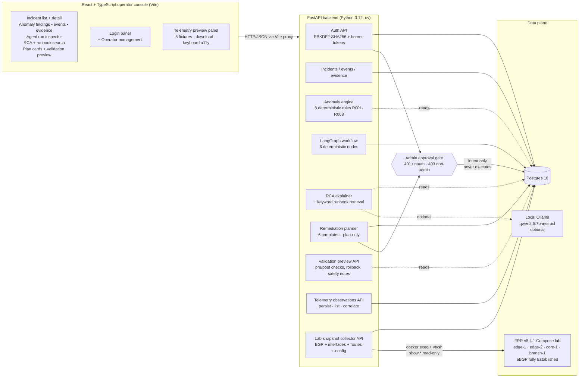

# NeuroNOC

NeuroNOC is an open-source operator console for AI-assisted network operations: it collects read-only signals from a real lab (or synthetic simulator), detects anomalies with deterministic rules, runs a multi-step LangGraph workflow to assemble an incident analysis, generates an optional local-LLM root-cause explanation, drafts a structured remediation plan, and gates approval behind authenticated admin role-based access. **No remediation is ever executed.**

Built as a portfolio-scale demonstration of AI-NetOps thinking: human-in-the-loop by construction, deterministic where determinism matters, LLM where it earns its keep, and explicit about the line between "this is real lab data" and "this is fabricated for demo purposes."

## What problem this addresses

NetOps teams routinely fly blind: telemetry is noisy, root causes hide under three layers of symptoms, and the safe response to "the WAN edge BGP session just flapped" is usually a slow human pager-thread because no automated tool is trusted enough to act. NeuroNOC explores what a small, opinionated NetOps copilot looks like when the entire stack is built **safety-first from the schema up**:

- Every plan is `requires_approval=True` at the database level.
- Approval is bound to a real authenticated `admin` session, not a free-text name field.
- No module under `app/remediation/`, `app/api/remediation.py`, `app/validation/`, or `app/telemetry/` is allowed to `import` a remote-execution library — an AST scan fails the build if it ever happens.
- The FRR lab collector only runs `show *` commands, only against an allow-listed set of container names, and rejects any vtysh invocation containing `clear` / `conf t` / `reload` / `delete` / `write` / etc.

The system is not yet a production NetOps tool. It is a working portfolio piece that demonstrates the architecture, the safety contracts, and the deterministic-and-LLM hybrid agent flow end-to-end on a real (FRR Compose) lab.

## Safety-first principle

Every phase preserves the same guardrails:

1. **No execution path exists in code.** The remediation planner produces plans only; the validation preview omits `proposed_commands` / `proposed_ansible_playbook` so it can't be mistaken for an actionable artifact; the lab collector is `show`-only and runs against an allow-listed container set.
2. **Approval is authenticated and role-gated.** `POST /api/remediation/recommendations/{id}/approve` returns 401 without a bearer token and 403 without `role=admin`. The audit row's `approved_by` / `approved_by_operator_id` are taken from the session, never from the request body.
3. **AST safety scans run in CI.** Any import of `subprocess` / `paramiko` / `netmiko` / `napalm` / `ansible_runner` / `pysnmp` / `socket` / etc. inside the protected packages fails the build.
4. **Ansible drafts gate every risky task on `when: false`** plus a `REQUIRES APPROVED CHANGE WINDOW` comment, so the file cannot run as-is even if someone hand-extracts it.
5. **Local-only LLM.** RCA uses local Ollama or a deterministic fallback; no cloud LLM dependency was added at any phase.

## Real lab data vs simulator/demo data

NeuroNOC carries two parallel data sources. Both populate the same `incidents` / `incident_events` / `incident_evidence` schema, so the downstream agent / RCA / planning chain treats them uniformly. **Where they came from is always tagged on `summary`.**

| Source | Tag prefix | What it is | Where it comes from |
|---|---|---|---|
| Simulator (Phase 3) | `[simulator]` | 5 hand-written scenarios (BGP down, interface errors, latency spike, route missing, ACL block) | `python -m app.simulator.seed --scenario all` — pure deterministic data |
| FRR lab collector (Phase 8C / 21A / 21E) | `[lab-collector]` | Read-only snapshot of a 4-router FRR Compose lab: BGP state + interface counters/status + route table + running-config | `POST /api/lab/collect/snapshot` — runs `docker exec` + `vtysh -c "show ..."` against the lab |
| Manual telemetry observations (Phase 22A/B) | derived | Operator-submitted (or test-fed) `TelemetryEvent` payloads persisted into `telemetry_observations` and optionally correlated into an Incident | `POST /api/telemetry/observations` + `POST /api/telemetry/observations/{id}/correlate` |

**Real-lab anomaly coverage after Phase 21E:** 4 of 8 rules fire from real lab data (R001 `bgp_neighbor_down_detected`, R003 `interface_error_spike_detected`, R007 `route_missing_detected`, R008 `link_down_detected`). The remaining 4 rules (R002 route withdrawal, R004 packet loss, R005 latency spike, R006 ACL deny) are simulator-only — the FRR lab does not produce those signals.

## Architecture



## Main user flow

```
Inject lab fault              →  Collect lab snapshot         →  Inspect findings
(lab.sh inject ...)              (one click in console)          (anomaly + events + evidence)

       ↓                                                              ↓

Approve / reject as admin     ←  Generate remediation plan    ←  Generate RCA + runbook hits
(bearer-token + role=admin)      (plan-only · requires_approval)  (Ollama or deterministic fallback)
```

Each step is a single console button click; the underlying API responses are stored in Postgres and re-render the right-hand detail pane. No background jobs, no scheduler — every action is an explicit operator request.

## Current feature set

| Phase | Surface | What it does |
|---|---|---|
| 1–2 | Backend / Postgres | FastAPI + SQLAlchemy 2 + Alembic; `devices` / `incidents` / `incident_events` / `incident_evidence` / `recommendations` tables |
| 3 | Simulator | 5 deterministic scenarios; CLI + API; surgical `--reset` |
| 4 | Anomaly engine | 8 deterministic rules (R001–R008), no ML |
| 5 | Agent workflow | LangGraph 1.x StateGraph, 6 nodes, per-step audit in `agent_runs` / `agent_steps` |
| 6 | RCA | Optional local Ollama (`qwen2.5:7b-instruct`); deterministic fallback when unreachable |
| 7 | Remediation | Plan-only, 6 templates, AST scan blocks execution-library imports |
| 8B/8C | FRR lab + collector | 4-router Compose lab + read-only `docker exec` + vtysh collector |
| 9A–9C | Operator console | React + TS master/detail, action buttons, demo flow doc |
| 10A/10B | Approval workflow | `approval_status` + audit columns, inline approval form |
| 11A | Watch loop | Bounded dev-only `--watch --iterations N` (≤100, ≤3600 s) |
| 12A | Playwright e2e | Chromium smoke against real backend + real Postgres + real Vite proxy |
| 13A/13B | Operators | `operators` table + UI panel for creating/listing operators |
| 14A/14B | CI | GitHub Actions (backend / frontend / e2e jobs) + Playwright failure traces |
| 15A/15B | Agent inspector | Step-by-step run inspector, duration, payload-shape chips, copy-report |
| 16A/16B | Validation preview | `GET /api/validation/recommendations/{id}/preview`; UI block; commands intentionally omitted |
| 17A/17B | Runbook search | Deterministic keyword retrieval over bundled Markdown runbooks; UI panel |
| 18A–20B | Telemetry preview | `TelemetryEvent` schema, validate + correlate endpoints (no persistence yet), UI panel with 5 fixtures, sanitized JSON export |
| 21A | Lab snapshot collector | Umbrella `POST /api/lab/collect/snapshot`: BGP + interfaces + running-config |
| 21B | Demo-path e2e | End-to-end test pinning lab snapshot → agent → RCA → planner chain |
| 21C | Lab → anomaly | Lab events feed R001 / R003 / R008 → planner picks specific templates |
| 21D | Lab fault injection | `lab.sh inject bgp-down <router>` / `lab.sh inject iface-down <router> <iface>` + smoke test |
| 21E | Route-table snapshots | Lab collector reads `show ip route json`, emits `lab_route_missing` → R007 |
| 22A | Telemetry persistence | `telemetry_observations` table + persist/list/get endpoints |
| 22B | Telemetry → incident | `POST /api/telemetry/observations/{id}/correlate` — deterministic, idempotent, on-demand |
| 23 | Auth + RBAC | PBKDF2-SHA256 passwords, bearer-token sessions, role-gated approval (admin only) |
| 24 | Packaging + docs | This README, demo checklist, roadmap status summary |

## Prerequisites

- macOS or Linux
- Docker Desktop (or Docker Engine + Compose v2)
- Python 3.12 and [uv](https://docs.astral.sh/uv/)
- Node 20+ and pnpm 10+
- *(Optional, for live RCA)* Ollama on host port 11434 with `qwen2.5:7b-instruct` pulled
- *(Optional, for the lab demo)* `frrouting/frr:v8.4.1` image cached locally

## Run locally

### 1. Start Postgres

```bash
docker compose up -d postgres
```

Postgres listens on `localhost:5433`. Dev credentials: `neuronoc / neuronoc_dev_password / neuronoc`.

### 2. Backend

```bash
cd backend
uv sync
uv run alembic upgrade head            # idempotent; current head: 466922adacef (Phase 23)
uv run uvicorn app.main:app --host 127.0.0.1 --port 8000
```

Interactive API docs: `http://127.0.0.1:8000/docs`.

### 3. Seed simulator data + the demo admin operator

```bash
cd backend
uv run python -m app.simulator.seed --reset
uv run python -m app.simulator.seed --scenario all
uv run python -m app.operators.seed --name local-operator --role admin --password demo-password
```

The seed CLI is idempotent — re-running with `--password` rotates the hash on the existing row.

### 4. Frontend

```bash
cd frontend
pnpm install
pnpm dev
```

Open `http://localhost:5173`. The Vite dev server proxies `/api/*` and `/health` to `http://127.0.0.1:8000`, so no CORS setup is needed.

### 5. (Optional) Bring up the FRR lab for the real-data demo path

```bash
./infra/lab/scripts/lab.sh up
./infra/lab/scripts/lab.sh bgp all      # every session should be Established
```

## Run tests

### Backend

```bash
cd backend
uv run pytest -q
```

268 tests as of Phase 23. Each test runs inside a savepoint that's rolled back at teardown, so the dev DB stays clean. Requires Postgres up on `localhost:5433`.

### Frontend build (type-check + bundle)

```bash
cd frontend
pnpm build       # tsc -b && vite build under strict TypeScript
```

### Playwright e2e (real backend + real Postgres + real Vite)

```bash
cd frontend
pnpm exec playwright install chromium    # one-time, ~100 MB
pnpm test:e2e                            # headless
pnpm test:e2e:headed                     # watch in a real window
```

25 tests, serial, single worker, `retries: 0`. The harness auto-starts both dev servers via Playwright's `webServer` config. `globalSetup` resets + re-seeds the simulator and seeds `local-operator` (with the Phase 23 demo password); `globalTeardown` resets simulator data so the dev DB is left as it was found.

### Lab helper smoke (no Docker required)

```bash
./infra/lab/scripts/test_lab.sh
```

33 assertions in <1 s. Fake-`docker`-on-PATH capture pins the exact vtysh / `ip link` command strings `lab.sh inject` / `heal` emit per fault.

### CI (GitHub Actions)

`.github/workflows/ci.yml` runs the backend / frontend / e2e jobs in parallel on every push and PR against a Postgres 16 service container. The FRR lab and Ollama are not run in CI (Docker-in-Docker / no GPU); the e2e RCA test accepts either a live model line or the deterministic fallback so the gate stays green either way.

## Demo checklist (recruiter-facing walkthrough)

Run this top-to-bottom for a live demo. Every step is one command or one click.

```
[ ]  1. Start Postgres
        docker compose up -d postgres

[ ]  2. Apply schema + seed simulator + seed the admin operator
        cd backend
        uv run alembic upgrade head
        uv run python -m app.simulator.seed --reset
        uv run python -m app.simulator.seed --scenario all
        uv run python -m app.operators.seed --name local-operator --role admin --password demo-password

[ ]  3. Start the backend (terminal A)
        cd backend && uv run uvicorn app.main:app --host 127.0.0.1 --port 8000

[ ]  4. Start the frontend (terminal B)
        cd frontend && pnpm dev
        # Open http://localhost:5173

[ ]  5. Start the FRR lab (terminal C)
        ./infra/lab/scripts/lab.sh up
        ./infra/lab/scripts/lab.sh bgp all          # confirm Established baseline

[ ]  6. Inject a real lab fault
        ./infra/lab/scripts/lab.sh inject bgp-down edge-1
        # (or, richer mixed-fault: lab.sh inject iface-down edge-1 eth0)

[ ]  7. In the operator console header, click "Collect lab snapshot"
        → A new Incident appears tagged [lab-collector],
          incident_type=lab_full_snapshot, severity=medium (or higher).

[ ]  8. Click that Incident in the list. The detail pane should show:
        - Anomaly findings: bgp_neighbor_down_detected (R001),
          plus link_down_detected (R008) if you injected iface-down.
        - Events: lab_bgp_peer_not_established, lab_interface_status,
          and any lab_route_missing if route-table coverage triggered.
        - Evidence: per-router running_config_snapshot and
          route_table_snapshot rows.

[ ]  9. Click "Run agent analysis"
        → Phase 5 LangGraph runs 6 deterministic nodes;
          new agent-run card lists every step; expand any one to see
          input/output payloads in the inspector.

[ ] 10. Click "Generate RCA"
        → If Ollama is up: "RCA via qwen2.5:7b-instruct".
        → If not: "RCA (deterministic fallback)". Either is fine.
          The RCA section persists across re-renders (Phase 9A polish).

[ ] 11. Click "Generate remediation plan"
        → A plan card appears with risk badge + plan_type
          (specific template, NOT generic_investigation, because
          Phase 21C maps lab events to specific findings).
        → Click "Preview validation": only pre-checks / post-checks /
          validation criteria / rollback steps / safety notes render.
          proposed_commands and proposed_ansible_playbook are
          intentionally absent — the response can't be mistaken for
          an executable artifact.

[ ] 12. In the Login panel, log in
        display_name: local-operator
        password:     demo-password
        → "Logged in as local-operator [admin]".

[ ] 13. Back on the plan card, click "Approve" (or "Reject").
        Confirm. The badge flips to approved/rejected; the audit
        line shows the authenticated operator's display_name + role
        + timestamp + note.
        → Backend recorded the approval intent.
        → Nothing was executed. There is no execution path in code.

[ ] 14. (Optional) Show the safety contracts directly
        cd backend
        uv run pytest -q tests/test_remediation.py::test_remediation_package_blocks_execution_library_imports
        uv run pytest -q tests/test_telemetry.py::test_telemetry_package_blocks_network_and_execution_imports

[ ] 15. Heal the lab
        ./infra/lab/scripts/lab.sh heal bgp-down edge-1
        sleep 35                                 # let BGP hold-timer reconverge
        ./infra/lab/scripts/lab.sh bgp all       # back to Established

[ ] 16. Tear down
        ./infra/lab/scripts/lab.sh down
        cd backend && uv run python -m app.simulator.seed --reset
        # Ctrl-C the dev servers; docker compose stop postgres if desired.
```

## Known limitations

- **No continuous telemetry pipeline.** Phase 8C / 21A collectors are one-shot scrapers triggered by an API call (or the bounded `--watch` loop). There is no daemon, no scheduler, no streaming, no SNMP trap listener, no syslog UDP receiver.
- **No remediation execution.** By design, and pinned by AST scans. Approval is intent only.
- **Local dev auth.** Phase 23 ships PBKDF2-SHA256 + bearer tokens stored in `localStorage` on the frontend. Production should swap in a real IdP (SSO / SAML / OAuth) and move tokens to HttpOnly cookies behind that.
- **No multi-tenancy.** One operator pool, one incident namespace, one lab.
- **Real-lab anomaly coverage is partial (4 of 8 rules).** R002 / R004 / R005 / R006 fire only against simulator data — the FRR lab doesn't produce route-withdrawal, packet-loss, latency, or ACL-deny signals natively.
- **No vector RAG.** Runbook retrieval is in-process keyword scoring (title 2× / body 1×, alpha tie-break). Good enough for 5 bundled runbooks; would need pgvector + embeddings to scale.
- **macOS bash 3.2 portability for lab.sh.** `declare -A` is replaced with case-statement functions; tested via the `test_lab.sh` smoke.
- **Out-of-the-box demo data is fabricated.** The simulator's 5 scenarios are hand-written. Treat as fixtures, not production telemetry.

## Future work

- Real authentication via SSO / SAML / OAuth + RBAC granularity beyond admin / operator.
- Multi-tenancy + per-tenant device inventory.
- Production deployment (Kubernetes + Helm chart; Prometheus / Grafana / OpenTelemetry observability).
- Continuous telemetry ingest (real SNMP poller + syslog UDP receiver + streaming gNMI) writing into the existing `telemetry_observations` table.
- Vector RAG over runbooks / device configs / historical incidents (pgvector + embeddings).
- Batfish-based pre-deployment validation; Terraform / OpenTofu for IaC.
- Containerlab / Lima topology when veth pairs, L2 trunking, or multi-vendor images are needed.
- Optional gated execution path with explicit change-window controls + automatic rollback if post-checks fail.

## Repo layout

```
backend/    FastAPI app (Python 3.12, managed with uv)
frontend/   Vite + React + TS console (managed with pnpm)
infra/      Docker support: Postgres init.sql, lab Compose stack, lab.sh helper
docs/       architecture.md, roadmap.md
docker-compose.yml
.env.example
```

## License & status

Open-source, pre-alpha. Phases 1–23 implemented; Phase 24 is documentation finish. Not yet a production NetOps tool — no continuous telemetry pipeline, no remediation execution path, local dev auth only. Suitable as a working portfolio demonstration of safety-first agentic NetOps architecture.
